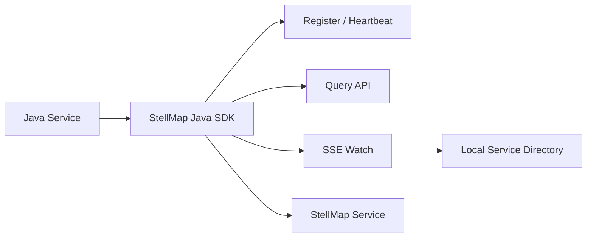

# StellMap Java SDK

面向 Java 微服务的 StellMap 服务注册与服务发现 SDK，提供服务注册、注销、心跳、实例查询、目录订阅、事件回调与本地缓存能力。

## 项目概述

`stellmap-java-sdk` 是 StellMap 注册中心的 Java 客户端。它不是简单的 HTTP 请求封装，而是面向业务服务、网关、边车、控制面组件提供稳定的服务目录访问能力。

该 SDK 的核心目标是：让调用方在本地进程内获得可恢复、可缓存、可订阅的服务发现能力，降低业务服务直接感知注册中心协议和事件流细节的成本。

## 当前状态

| 项目 | 说明 |
| --- | --- |
| 稳定性 | 开发中，已具备核心 SDK 能力 |
| 适用对象 | Java 微服务、网关、控制面组件、基础设施组件 |
| 核心协议 | HTTP / SSE |
| 主要依赖 | OkHttp、Jackson、OpenTelemetry 可选集成 |
| 维护方 | StellHub |

## 解决什么问题

- 服务实例注册、注销与心跳维护。
- 按 namespace、service、zone、endpoint、labels 等条件查询实例。
- 基于 SSE 的实例 watch 与目录 watch。
- 基于 revision 的断线重连、事件续传与缓存恢复。
- 在 SDK 内部维护本地服务目录，降低注册中心读压力。
- 为网关、Service Mesh、任务调度器等高并发组件提供更稳定的服务发现入口。

## 不解决什么问题

- 不负责服务端注册中心的数据存储与选主。
- 不提供业务鉴权、登录态、租户权限模型。
- 不提供完整负载均衡策略，只提供服务目录与实例数据。
- 不替代配置中心、限流中心或灰度发布系统。

## 核心能力

| 能力 | 说明 | 典型场景 |
| --- | --- | --- |
| 服务注册 | 注册当前实例到 StellMap | 服务启动上线 |
| 服务注销 | 主动移除实例 | 优雅下线 |
| 心跳续约 | 周期性维护实例存活状态 | 实例健康保持 |
| 实例查询 | 拉取服务实例快照 | 客户端发现、网关转发 |
| Watch 订阅 | 监听实例和目录变更 | 本地缓存实时更新 |
| 自动重连 | SSE 断线后自动恢复 | 网络抖动、服务端重启 |
| Revision 续传 | 从最近消费版本恢复事件流 | 防止事件丢失 |
| 本地缓存 | 维护服务到实例的本地快照 | 降低注册中心压力 |

## 架构说明



SDK 运行在业务进程内。普通注册、注销、心跳和查询请求通过 HTTP 完成；实例变更和目录变更通过 SSE 长连接接收。SDK 会将事件转换为 `RegistryWatchEvent`，并维护本地 `ServiceDirectory` 缓存。

## 快速开始

### 1. 引入依赖

```xml
<dependency>
    <groupId>io.github.stellhub</groupId>
    <artifactId>stellmap-java-sdk</artifactId>
    <version>${stellmap.version}</version>
</dependency>
```

### 2. 创建客户端

```java
StellMapClient client = StellMapClient.builder()
        .endpoint("http://localhost:8080")
        .namespace("default")
        .build();
```

### 3. 注册实例并启动心跳

```java
RegistryInstance instance = RegistryInstance.builder()
        .service("company.trade.order.order-center.api")
        .instanceId("order-center-api-10.0.0.12-8080")
        .host("10.0.0.12")
        .port(8080)
        .build();

client.registerAndScheduleHeartbeat(instance);
```

### 4. 订阅服务目录

```java
ServiceDirectorySubscription subscription = client.watchDirectory(
        RegistryWatchRequest.builder()
                .namespace("default")
                .servicePrefix("company.trade.order")
                .includeSnapshot(true)
                .build(),
        listener
);
```

## 配置说明

| 配置项 | 是否必填 | 默认值 | 说明 |
| --- | --- | --- | --- |
| endpoint | 是 | 无 | StellMap 服务端地址 |
| namespace | 是 | default | 命名空间 |
| connectTimeout | 否 | 3s | 连接超时时间 |
| readTimeout | 否 | 30s | 普通请求读取超时 |
| watchInitialBackoff | 否 | 1s | Watch 首次重连退避 |
| watchMaxBackoff | 否 | 10s | Watch 最大重连退避 |
| autoDeregisterOnClose | 否 | false | 客户端关闭时是否自动注销实例 |

## 本地开发

```bash
mvn clean test
mvn clean package -DskipTests
```

## 测试

提交代码前至少执行：

```bash
mvn clean verify
```

涉及 watch、重连、revision、缓存一致性的改动必须补充单元测试或集成测试。

## 版本与升级

版本号建议遵循语义化版本：

- `MAJOR`：不兼容 API 或行为变更。
- `MINOR`：向后兼容的新能力。
- `PATCH`：向后兼容的问题修复。

升级时重点关注：公共 API、默认超时时间、事件结构、重连策略和缓存语义。

## 可观测性

建议关注以下指标和日志：

| 类型 | 名称 | 说明 |
| --- | --- | --- |
| Metric | watch_reconnect_total | Watch 重连次数 |
| Metric | registry_request_total | 注册中心请求总数 |
| Metric | registry_request_latency | 注册中心请求耗时 |
| Log | WATCH_RECONNECT | Watch 自动重连 |
| Log | REVISION_EXPIRED | Revision 过期，需要重建快照 |
| Log | REGISTER_FAILED | 实例注册失败 |

## 故障排查

### 订阅没有收到事件

1. 检查 `endpoint` 和 `namespace` 是否正确。
2. 检查 `service` 或 `servicePrefix` 是否匹配服务端数据。
3. 查看是否出现 `REVISION_EXPIRED` 或 `WATCH_RECONNECT` 日志。
4. 确认服务端是否支持 SSE watch。

### 实例注册后查询不到

1. 检查实例是否心跳成功。
2. 检查注册和查询使用的 namespace 是否一致。
3. 检查服务名是否符合规范化命名约定。
4. 检查实例是否被服务端过期清理。

## 安全说明

- 不要在日志中输出敏感标签、鉴权头或内部拓扑信息。
- 不要将生产环境 endpoint、token 或租户信息提交到仓库。
- Watch 回调中不要执行长时间阻塞逻辑，避免影响事件消费。

## 目录结构

```text
.
├── src/            # SDK source code
├── examples/       # Example projects if available
├── docs/           # Extended documentation if available
├── pom.xml         # Maven build file
└── README.md       # Project guide
```

## 贡献规范

- 修改公共 API 前必须说明兼容性影响。
- 修改事件结构、重连策略或缓存语义时必须补充测试。
- 行为变更必须同步更新 README 或 docs。
- 不允许引入不必要的重量级依赖。

## 支持

由 StellHub 维护。建议通过 GitHub Issues 记录问题、需求和设计讨论。

## 许可证

以仓库内 `LICENSE` 文件为准。